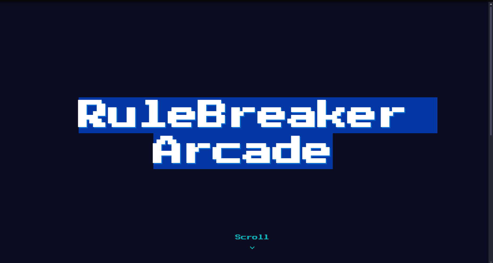

# RuleBreaker-Arcade

# [Project Name] 🎯

## Basic Details
### Team Name: [Name]

### Team Members
- Team Lead: Muhammed Rishad MP - TKM COLLEGE OF ENGINEERING
- Member 2: Sahal Muhammed Chalil - TKM COLLEGE OF ENGINEERING
- 
### Project Description
web application that presents a collection of classic games, each with a unique, chaotic twist. The code you've highlighted is specifically for the games like chess , ludo etc.

### The Problem (that doesn't exist)
For centuries, chess has been the ultimate game of strategy and intellect. It's a beautiful, balanced, and utterly predictable system. A knight always moves in an 'L' shape. A bishop is forever bound to its color. This perfect order is, frankly, a bit boring. The game is a solved puzzle waiting for players to execute the same opening moves they've memorized. It's missing a crucial element: pure, unadulterated chaos.

### The Solution (that nobody asked for)
My code shuffles the very identity of the pieces at the start of each game. Your queen might suddenly move like a knight, and your rook could be sliding diagonally like a bishop. To make things even more interesting, after a piece is used a few times, it might have an existential crisis and adopt a completely new movement pattern mid-game! You'll have to throw out your grand strategies and think on your feet. It’s chess where the only rule is that the rules will break.

## Technical Details
### Technologies/Components Used
For Software:
- HTML 
- CSS
- JS

### Project Documentation
For Software:

# Screenshots (Add at least 3)

*Add caption explaining what this shows*

*Add caption explaining what this shows*

*Add caption explaining what this shows*

### Project Demo
# Video
[Add your demo video link here]
*Explain what the video demonstrates*

# Additional Demos
[Add any extra demo materials/links]

## Team Contributions
- Muhammed Rishad MP: Technical and coding part
- Sahal Muhammed Chalil : Idea Development and technical support

---
Made with ❤️ at TinkerHub Useless Projects 

